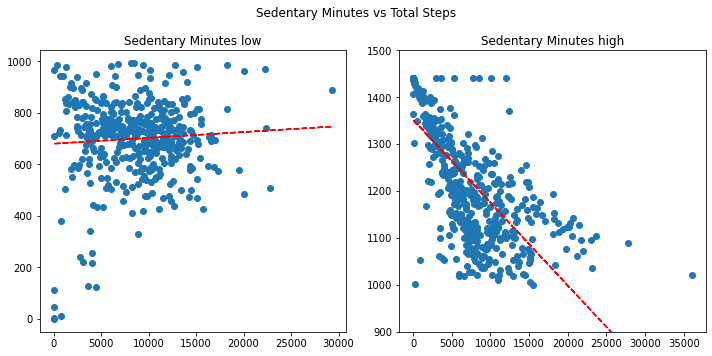

# 📊 Bellabeat Wellness Analysis

## 💡 Project Overview

This project is part of the Google Data Analytics Capstone Case Study. It focuses on analysing Fitbit smart device data to help **Bellabeat**, a wellness tech company for women, gain insights into user behaviour and inform future marketing strategies.

### 📌 Business Task
Explore smart device usage trends to provide data-driven recommendations for:
- Bellabeat’s product development
- Customer engagement strategies
- Wellness feature improvements

---

## 🧾 Data Source

The dataset was sourced from **[Kaggle - Fitbit Fitness Tracker Data](https://www.kaggle.com/datasets/arashnic/fitbit)**. It includes 30 users' physical activity, sleep, and heart rate data collected over a 31-day period.

| 📁 File | Description |
|--------|-------------|
| dailyActivity_merged.csv | Steps, distance, intensity and calories burned |
| hourlySteps_merged.csv | Hourly step count |
| heartrate_seconds_merged.csv | Second-level heart rate data |
| sleepDay_merged.csv | Sleep duration and quality |
| weightLogInfo_merged.csv | Weight, BMI logs |
| ...and more |

⚠️ Note: Dataset is limited to one month in Spring 2016 and has only 30 participants.

---

## 🧹 Data Cleaning

- Cleaned using **Excel** (datetime formats, delimiters, duplicates).
- Converted CSVs to `.xlsx`, fixed column types and formulas.
- Used **Python (pandas, matplotlib, seaborn)** for aggregation and visualisation.
- Created daily aggregates and merged multiple datasets by `Id` and `Date`.

---

## 📈 Key Insights

1. **Step Tracking & Sedentary Behaviour**  
   - Users with >1000 sedentary minutes showed inverse correlation with daily steps.  
   - Bellabeat devices can nudge users to increase daily steps and reduce sedentary time.

2. **Calories Burned & Activity Levels**  
   - Calories burned showed strongest correlation with *Very Active Minutes*.  
   - Devices can visualise activity-effort-reward patterns for better motivation.

3. **METs (Metabolic Equivalent of Task)**  
   - METs are strongly correlated with very active minutes.  
   - Could be used to personalise fitness recommendations.

4. **Sleep Tracking**  
   - Strong correlation between time in bed and minutes asleep.  
   - Devices can help improve sleep quality with insights and alerts.

5. **Limited Weight/BMI Data**  
   - Only 8 users logged weight. Suggests low usage or difficulty with manual entry.

---

## 📊 Visualisations

- Scatter plots to show step count vs. activity minutes  
- Correlation heatmaps for calories, METs, and sleep metrics  
- Segmentation based on sedentary time  

---

## ✅ Recommendations for Bellabeat

- Promote step tracking goals to reduce sedentary time.
- Include METs and active minutes in the mobile app dashboard.
- Provide alerts for prolonged inactivity or sleep pattern issues.
- Integrate nutrition/calories intake features to complement calorie burn.
- Focus on acquiring **female-specific data** for better insight alignment.

---

## 🛠️ Tools Used

- Python (pandas, matplotlib, seaborn)
- Excel
- Jupyter Notebook
