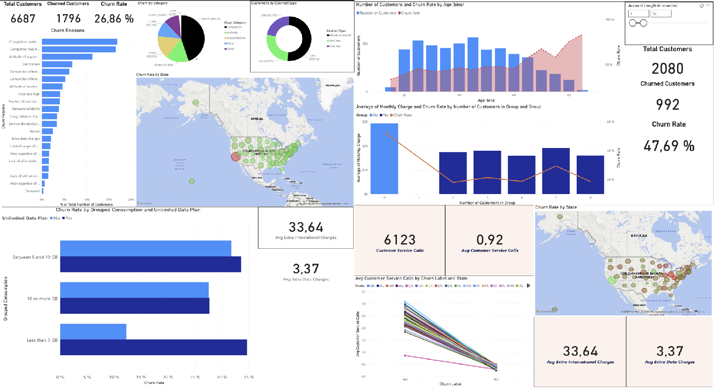

# 📊 Power BI Case Study: HR Analytics

## 📌 Overview

This case study demonstrates how Power BI can be used to analyse employee data and uncover insights into attrition, demographics, and salary patterns.

The project is based on the fictional company **Atlas Labs** and is part of the Data Analyst with Power BI learning path.

---

## 🎯 Goals

- Monitor key HR metrics
- Understand employee demographics
- Identify patterns linked to attrition
- Build an interactive dashboard for decision-makers

---

## 📷 Screenshots

### Dashboard Overview

## 🛠️ Tools Used

- Power BI
- DAX Measures
- Data Modeling (relationships, hierarchies)
- Data transformation with Power Query

---

## 📁 Files

- `Data Camp_Case Study_HR Analytics in Power BI.pbix`: Full interactive Power BI report
- `data/`: Contains datasets
- `screenshots/`: Key visuals for GitHub display

---

## 🙋 About Me

I'm **Alex Popov**, a career-switching data analyst passionate about solving business problems through data storytelling and visualisation.  
🔗 [LinkedIn](https://www.linkedin.com/in/aleksandrpopov88) | [GitHub Portfolio](https://github.com/AlexPopov88)
